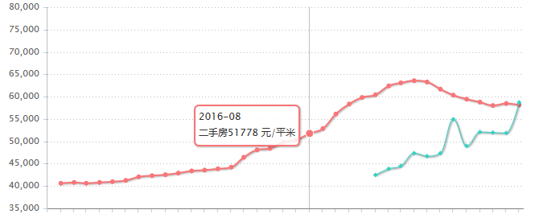
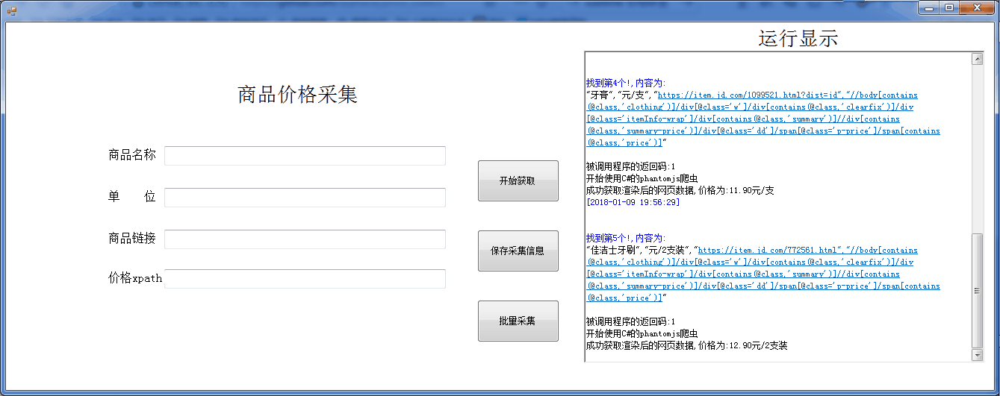
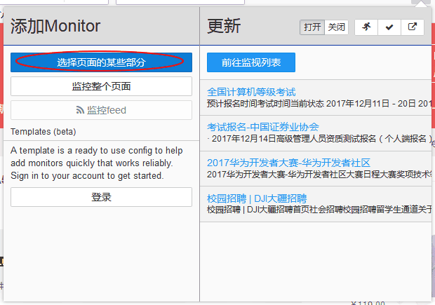
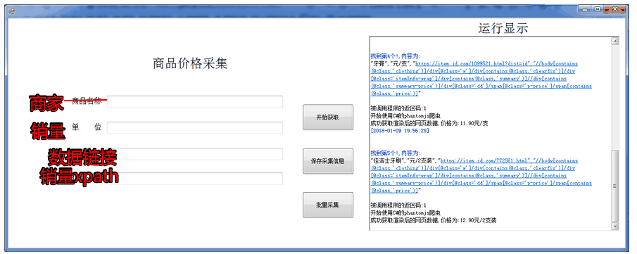

# price_collect

**股票,房价可以找到下面这样的价格走势图,一般的商品怎么没有价格走势呢?**

**怎么去记录价格的波动情况,进而去预测未来呢?数据分析呢**  

自动获取价格是非常关键的,不可能人工每天去打开网页记录信息吧?尤其是你关注的信息比较多时。

为了**获取我们关心的数据**,我做了这个操作简便的爬虫程序。**一个小学生都可以很便捷地做大数据的采集**。目前正在开发，后期将自动生成走势图、程序定期自动运行。**一年之后，不就有了一年的数据吗？**随着时间的积累，我们可参考的数据会越来越多。

（若要用于获取某个网站的所有价格，可以用命令行调用我的另一个项目"price_collect_python"里`采集价格.exe` ）

### 1.介绍

界面是这样的，只要输入物品的链接和它的xpath，点击`开始获取` 即可。采集信息保存在`price_collect\bin\x64\Debug\商品价格`目录中的csv文件中， 文件名为 `商品名`

xpath是什么？它是用来定位数据的位置的,**不懂没关系! 能找到它就行了** 

使用火狐浏览器，打开一个商品链接：https://item.jd.com/2330112.html

安装插件`Distil Web monitor` ,点击它的图标,然后点`选择页面的某些部分` ,然后用鼠标点击`价格所在的位置` 

**本程序的界面针对价格获取量身定做，是受股票的启发，实际上里可以用来获取任何数据，GDP、销售量、评分；只需要将界面上的文字修改一下，即可**

### 2.编译、运行

用visual studio打开工程文件	`price_collect.sln`   ,编译运行.

也可以通过下面链接下载,百度云：https://pan.baidu.com/s/1bq9W8rl 密码：ee25

### 3.文件介绍

`/Debug/价格采集.exe` 、`/Release/价格采集.exe`python写的爬虫,**数据如果经过浏览器加载渲染才能得到**,它就会失败。于是通过C#调用`phantomjs.exe`完成

- 我也有写一个,通过python调用`phantomjs.exe`的爬虫,在此附上项目地址：

  链接：https://pan.baidu.com/s/1smIr46L 密码：a65t

`价格采集.py` ：`价格采集.exe`的 源代码，编译方法见[编译py文件并复制到对应位置.bat](https://github.com/qqblack/price_collect/blob/master/编译py文件并复制到对应位置.bat) 

### 4.疑难解答

见 [疑难解答.md](https://github.com/qqblack/price_collect/blob/master/疑难解答.md) 

### 将来的版本

1. 添加，一键添加`定时任务` ,定期爬取数据
2. 添加，一键生成`走势图`,掌握行情变化，预测未来趋势
3. 有了数据库之后，提供给用户搜索，让商品价格就像股票价格一样清晰

### 欢迎提出意见

- 1.欢迎上传改进代码、更多商品xpath信息
- 2.反应评论、留言
- 2.我的联系方式:1137146278@qq.com , 或关注`坛子分享` 微信公众号,这个我回复得更及时一点