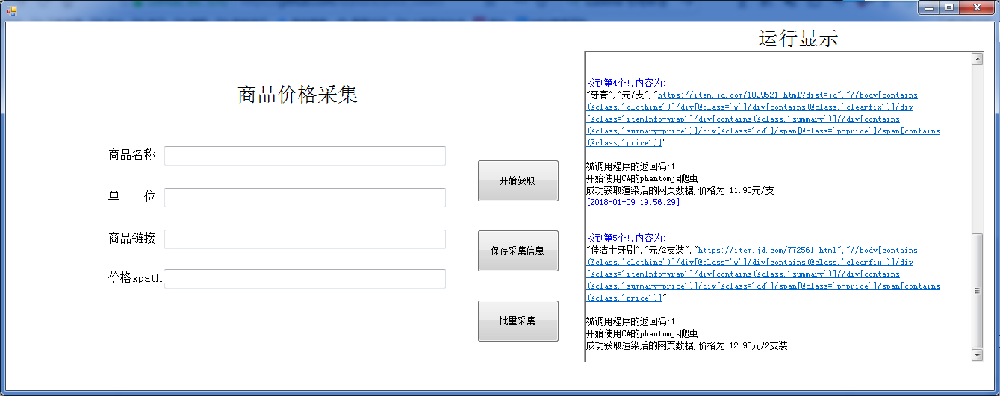
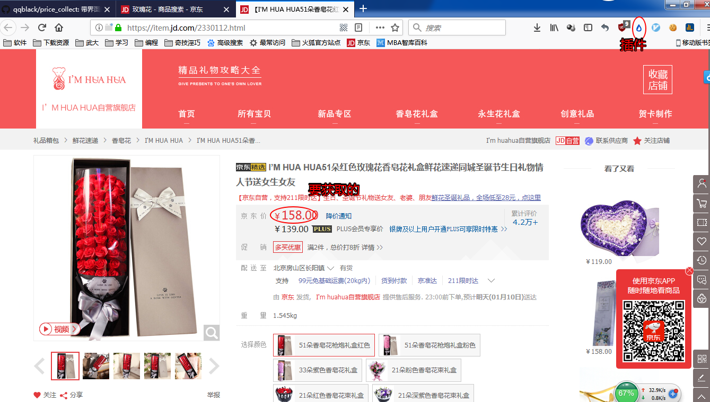
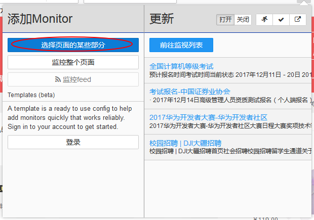
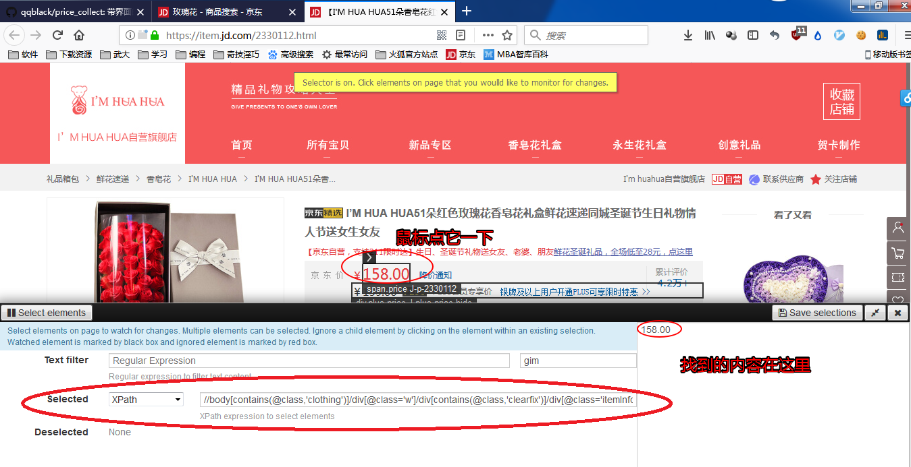

# price_collect

### 1.介绍

界面是这样的，只要输入物品的链接和它的xpath，点击`开始获取` 即可。采集信息保存在`price_collect\bin\x64\Debug\商品价格`目录中的csv文件中， 文件名为 `商品名`

xpath是什么？它是用来定位数据的位置的,**不懂没关系! 能找到它就行了** 

使用火狐浏览器，打开一个商品链接：https://item.jd.com/2330112.html

安装插件`Distil Web monitor` ,点击它的图标,然后点`选择页面的某些部分` ,然后用鼠标点击`价格所在的位置` 

### 2.编译、运行

用visual studio打开工程文件	`price_collect.sln`   ,编译运行.

也可以通过下面链接下载,